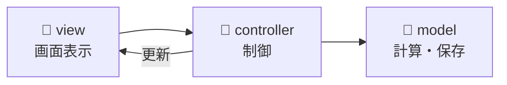

# FX & US Stock Break-even Simulator

## 🔗 Live Demo

**[https://us-stock-fx-simulator.vercel.app/](https://us-stock-fx-simulator.vercel.app/)**

## 概要

米国株を購入した際の **株価 × 為替** の組み合わせに対し、  
売却時の損益分岐点を直感的に可視化する Web ベースのシミュレーターです。

株価と為替を個別に考えるのではなく、
「どの株価・どの為替水準で損益が ±0 になるか」を
グラフ上で一目で把握できることを目的としています。

---

## 背景・解決したかった課題

- 米国株投資では **株価変動と為替変動を同時に考える必要がある**
- Excel では試行錯誤のたびに計算式やグラフを修正する必要があり、操作コストが高い
- 「どの条件でプラス／マイナスになるのか」を直感的に把握しづらい

これらを解決するため、
**ブラウザ上で即座に条件を変更できるシミュレーター**として本ツールを作成しました。

---

## 主な機能

- 株価・為替・購入数量の入力
- 損益分岐点ラインのグラフ表示
- 複数購入（ナンピン）を考慮した計算
- UI 操作に応じたリアルタイム再計算
- モーダル UI による購入情報の管理
- 状態の保存・復元機能

---

## 技術スタック

- **フロントエンド:** HTML / CSS / JavaScript（Vanilla JS）
- **グラフ描画:** Plotly.js
- **UI フレームワーク:** Bootstrap 5
- **テスト:** Vitest
- **デプロイ:** Vercel

**主な外部ライブラリ:**

- [Plotly.js](https://plotly.com/javascript/) - インタラクティブなグラフ描画
- [Bootstrap 5](https://getbootstrap.com/) - レスポンシブ UI
- [noUiSlider](https://refreshless.com/nouislider/) - 範囲選択スライダー

※ フレームワークに依存せず、
状態管理および責務分離を自力で設計した場合に、
実装や保守性がどのような構造になるかを検証する目的で実装しました。

## プロジェクト構造

```
us-stock-fx-simulator/
├── public/
│   ├── controller/          # イベント制御・状態管理
│   │   ├── events.js       # ユーザーイベント処理
│   │   ├── graphController.js
│   │   ├── modalEvents.js
│   │   ├── modelFacade.js
│   │   └── stateController.js
│   ├── model/              # ビジネスロジック
│   │   ├── calc.js         # 損益計算ロジック
│   │   ├── pins.js         # ピン（注目ポイント）管理
│   │   └── state.js        # 状態の保存・復元
│   ├── view/               # UI・表示ロジック
│   │   ├── form.js         # フォーム管理
│   │   ├── plot.js         # グラフ描画
│   │   ├── pinSettings.js  # ピン設定UI
│   │   ├── rangeSlider.js  # スライダー制御
│   │   ├── saveImage.js    # 画像保存機能
│   │   └── toast.js        # 通知表示
│   ├── utils/              # 共通ユーティリティ
│   │   ├── stateUtils.js
│   │   └── textContent.js
│   ├── index.html          # メインHTML
│   ├── main.js             # エントリーポイント
│   └── styles.css          # スタイルシート
├── tests/                  # テストファイル
│   ├── calc.test.js
│   ├── aggregate.test.js
│   └── fixtures/           # テストデータ
├── package.json
└── README.md
```

---

## アーキテクチャ

### ファイル構成



**MVC パターンで責務分離:**

- **view/**: グラフ描画・フォーム管理（UI のみ）
- **controller/**: イベント処理・状態管理
- **model/**: 損益計算・データ保存（UI 非依存）

---

## 設計方針

本ツールでは、規模が小さくても **構造を意識した設計** を重視しました。

### MVC ライクな責務分離

- **Model（`model/`）**：損益計算ロジック・データ管理
  - View/Controller に依存しない純粋な計算処理
  - 単体テスト可能な設計
- **View（`view/`）**：DOM 操作・グラフ描画
  - ビジネスロジックを持たない
  - 再利用可能な UI コンポーネント
- **Controller（`controller/`）**：入力イベントと状態更新の仲介
  - Model と View を繋ぐ役割
  - イベントハンドリング

### 状態管理の一元化

- UI 状態・購入情報を `stateController` で一元管理
- LocalStorage を活用した永続化
- 状態の検証・復元機能

### 計算ロジックと UI の分離

- 将来的な UI 変更やフレームワーク移行を想定
- ロジック部分は独立してテスト可能
- DOM 操作を View に集約

あとから仕様を変えたり機能を足したりしやすいように、
計算処理・画面表示・入力処理を
できるだけ分けて書くことを意識しました。

---

## 工夫した点

- モーダル画面を開き直すたびに入力内容が消えないよう、
  画面を作り直さず、状態を保持したまま表示・非表示を切り替える構成にしました。

---

## 制約・割り切り

- 型安全性（TypeScript）は未導入
  → 今後 TypeScript 化を予定
- テストカバレッジの可視化は未実装
  → `vitest --coverage` で確認可能にする予定
- 状態管理ライブラリは不使用

本リポジトリは **完成品というより PoC（設計検証）** という位置づけです。

---

## 外部通信について

本ツールでは、以下の外部通信を行います。

- 為替レート取得のため、`open.er-api.com` にアクセスします  
  （通信に失敗した場合は、固定値を使用して計算を行います）

- UI ライブラリ（Bootstrap / Plotly 等）は CDN 経由で読み込んでいます

---

## 今後の改善案

- TypeScript 化による型安全性向上
- React / Vue などのフレームワークへの移行
- ロジック部分のユニットテスト追加
- UI/UX（モバイル対応・アクセシビリティ）の改善

---

## 開発者向け情報

### npm スクリプト

```bash
# 開発サーバー起動
npm run dev

# テスト実行
npm test

# ビルド（静的HTMLのため不要）
npm run build
```

---

## ライセンス

MIT License
