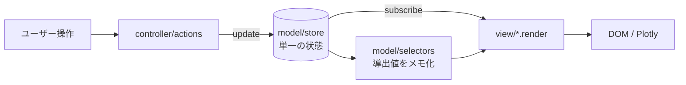

# FX & US Stock Break-even Simulator

[](https://github.com/Taka-S-dev/us-stock-fx-simulator/actions)

## Live Demo

**[https://us-stock-fx-simulator.vercel.app/](https://us-stock-fx-simulator.vercel.app/)**

## 概要

米国株を購入した際の **株価 × 為替** の組み合わせに対し、
売却時の損益分岐点を可視化する Web ベースのシミュレーターです。

株価と為替を個別に考えるのではなく、
「どの株価・どの為替水準で損益が ±0 になるか」を
グラフ上で一目で把握できることを目的としています。

---

## 背景・解決したかった課題

- 米国株投資では **株価変動と為替変動を同時に考える必要がある**
- Excel では試行錯誤のたびに計算式やグラフを修正する必要があり、操作コストが高い
- 「どの条件でプラス／マイナスになるのか」を直感的に把握しづらい

これらを解決するため、
**ブラウザ上で即座に条件を変更できるシミュレーター**として本ツールを作成しました。

---

## 主な機能

**「で、結局どうなのか」に数字で答える** ことを重視しています。

- **現在の含み損益** — 現在の株価・為替から評価額と損益を常時表示
  （未入力なら取得した為替レートと平均購入株価に自動追従）
- **損益分岐までの距離** — ±0 に必要な変化量を「株価だけが動く場合」
  「為替だけが動く場合」の両方向で提示
- **感応度** — 為替が 1 円／株価が $1 動いたときに損益が何円変わるか。
  1 単位あたりでどちらの影響が大きいかも示す
- **シナリオ比較** — 為替 ±10 円 × 株価 ±20% の 3×3 表
- **損益分岐グラフ** — 株価 × 為替の 2 軸の等高線（金額ラベル付き）、
  損益分岐ライン、平均購入点、現在地
- **売却条件（プローブ）** — グラフ上の点を
  クリック／ドラッグ／矢印キー／数値入力で動かし、その条件での損益と
  現在地からの差分を読み取れる。気に入った条件はピンとして残せる
- 複数回の購入（ナンピン）と手数料・諸経費を含めた取得総額の計算
- 売却候補ピンによる条件の固定と比較
- 設定の保存・復元（ブラウザ内）／グラフの PNG 出力
- ダークモード（OS 追従 / ライト / ダーク）

---

## 技術スタック

- **フロントエンド:** HTML / CSS / JavaScript（Vanilla JS、ビルド不要）
- **グラフ描画:** Plotly.js（cartesian バンドル）
- **UI:** Bootstrap 5.3
- **スライダー:** noUiSlider
- **テスト:** Vitest
- **静的解析:** ESLint / Prettier
- **デプロイ:** Vercel

外部リソースはすべてバージョンを固定し、`integrity`（SRI）を付与しています。

> フレームワークに依存せず、状態管理と責務分離を自力で設計した場合に
> 実装と保守性がどのような構造になるかを検証する目的で実装しています。

---

## アーキテクチャ

### 一方向のデータフロー

状態を 1 か所に集約し、「状態が変わったら描き直す」だけの流れに閉じています。
View が別の View を直接更新することはありません。


```mermaid
graph LR
  U[ユーザー操作] --> C[controller/actions]
  C -->|update| S[(model/store<br/>単一の状態)]
  S -->|subscribe| R[view/*.render]
  R --> D[DOM / Plotly]
  S --> Sel[model/selectors<br/>導出値をメモ化]
  Sel --> R
```

この構造にしたことで、旧実装にあった
「スライダーの初期化を `setTimeout` で待つ」「復元後に DOM を直接書き換える」
といった時間依存の同期処理が不要になりました。

### ディレクトリ構成

```
public/
├── model/                  # 計算・状態・永続化（DOM 非依存 / テスト対象）
│   ├── calc.js             # 損益計算・損益分岐（純粋関数）
│   ├── analysis.js         # 感応度・分岐までの距離・シナリオ比較
│   ├── purchase.js         # 入力値の検証と正規化
│   ├── store.js            # 単一ストア（subscribe / update）
│   ├── selectors.js        # 状態からの導出値（メモ化）
│   ├── persistence.js      # localStorage への保存・復元・移行
│   └── fxRate.js           # 為替レート取得（fetch を注入可能）
├── controller/
│   ├── actions.js          # 状態を変える操作の集約
│   └── app.js              # View と状態の配線
├── view/                   # DOM 描画のみ（state を受け取って描く）
│   ├── dom.js              # 要素生成ヘルパ（innerHTML を使わない）
│   ├── purchaseList.js     # 購入情報の入力行
│   ├── rangeControls.js    # 表示範囲のスライダー
│   ├── pinList.js          # 売却候補ピン
│   ├── savedStates.js      # 保存データの選択
│   ├── currentPosition.js  # 現在の含み損益と損益分岐までの距離
│   ├── probe.js            # 売却条件の読み取り値
│   ├── analysis.js         # 感応度パネル・シナリオ比較表
│   ├── summary.js          # 取得の内訳・選択位置の損益
│   ├── plot.js             # Plotly の図の組み立てと描画
│   ├── saveImage.js        # PNG 出力（plot.js と同じ図を使う）
│   ├── theme.js            # ライト / ダークの切り替え
│   └── toast.js            # 通知・確認ダイアログ
├── utils/format.js         # 表示用の整形（単位・記号はここだけ）
├── index.html
├── styles.css
└── main.js
```

### 設計上の決めごと

- **model は数値だけを返す。** `"12.34%"` のような表示用文字列を model が作らない
- **表示整形は `utils/format.js` に集約する。** 単位や記号の付け方を 1 か所にまとめる
- **同じ値を二重に持たない。** 集計値・グラフデータは状態に置かず `selectors` で導出する
- **DOM を状態の保管先にしない。** DOM から読み直すのは入力欄の生テキストのみ
- **`innerHTML` を使わない。** 保存名などの文字列が HTML として解釈される余地をなくす
- **画面と画像出力で同じ図を使う。** `buildFigure()` を共有し、見た目の食い違いを防ぐ

### 分析の考え方

損益は

```
損益(円) = 為替 × 株価 × 株数 − 取得総額(円)
```

という **双一次式** です。この形が分かっていれば、主要な分析はすべて
数値探索なしに閉じた形で解けます。

**損益分岐ライン** — 損益 0 の条件は

```
為替 × 株価 = 取得総額 ÷ 株数 = 平均取得価額(円/株)
```

という双曲線。旧実装は 200×200 のグリッドを走査して符号の反転を探していましたが、
上式から直接求まるため、走査せずに厳密な曲線を描いています。

**感応度** — 偏微分がそのまま「1 単位あたりの損益変化」になります。

```
∂損益/∂為替 = 株価 × 株数      … 為替が 1 円動いたとき
∂損益/∂株価 = 為替 × 株数      … 株価が $1 動いたとき
```

率で見た場合はどちらも `為替 × 株価 × 株数 × 1%` で一致します。
つまり **％では為替と株価の影響は等しく、差が出るのは 1 円/1 ドル単位で見たとき**
だけ、という関係を UI 上でも示しています。

**損益分岐までの距離** — 片方を固定すれば、もう片方の分岐水準は
`平均取得価額 ÷ 固定した値` で逆算できます。

いずれも近似を使っていないため、テストでは
「求めた分岐水準を損益計算に戻すと 0 になる」「感応度が実際の差分と一致する」
という形で検証しています（[tests/analysis.test.js](tests/analysis.test.js)）。

### 画面構成の方針

**操作するものと、変わるものを離さない。**
表示範囲のスライダーは、それぞれが操作する軸に沿わせています
（為替＝グラフの下、売却株価＝グラフの左に縦向き）。
どちらがどの軸かを、ラベルを読ませずに位置関係だけで伝えるためです。
これは正確に揃っていて初めて成立するので、Plotly が実際に描いたプロット領域を
実測し、その長さと位置に合わせています（軸ラベル分だけ内側にあるため、
カード全体に合わせると軸とずれます）。
サイドバーに残しているのは、グラフの見た目に直結しない入力
（購入情報・ピン・保存）だけです。

**手入力は1か所に集める。**
購入情報・現在の株価と為替・手数料といった「打ち込む値」はすべてサイドバーにあり、
右側は結論・グラフ・分析だけです。現在の株価と為替はグラフ上の現在地マーカーに
なるため、入力欄のそばにその対応を書いています。

**同じ設定の入口を2つ作らない。**
表示範囲を操作できるのは軸のスライダーだけで、倍率ボタンもその端に置いています。
現在の範囲は軸の目盛りが示すので、範囲を数値で表示する欄も持ちません。

**結論とグラフを同時に見せる。**
画面の先頭に「現在の含み損益」と「±0 になる水準」を横並びで置き、
そのすぐ下にグラフが来ます。グラフを読まなくても結論は分かり、
かつグラフを動かしたときに数値がどう変わるかを見ながら確認できます。
数値を縦に積むとグラフが初期画面から押し出され、
プローブを動かしても因果が追えなくなるため、結論部分は高さを抑えています。

**グラフは表示装置ではなく入力装置。**
グラフ上の値は「ホバーすると一瞬見える」のではなく、動かして残せるプローブにしています。
ホバーは狙って操作できず結果も残らないため、比較にも精密な指定にも使えません。
プローブは クリック／ドラッグ／矢印キー／数値入力 の4つの手段で動かせて、
**見る → 動かす → ピンで留める** が一本の操作系列になります。

**数字は操作している場所に出す。**
プローブの損益はグラフ上のラベルにも出します。数字を読むために視線を
グラフの外へ動かす必要があると、動かしながら比べることができません。

ドラッグ中の座標変換は、プロット領域の矩形を Plotly が置く `.nsewdrag` 要素から
読んで求めています。余白を定数で持って計算していた旧実装と違い、
実際の描画結果を読むためレイアウト変更やレスポンシブでずれません
（軸の範囲は `fixedrange` で固定し、状態が持つ値と一致させています）。

タッチのドラッグはプローブの近くから始まったときだけ有効にしています。
プロット全面をドラッグ対象にすると、グラフの上でページをスクロールできなくなるためです。

**実装都合を UI に持ち込まない。**
株価スライダーは非線形スケール（トラック位置に対して `$1 → $50 → $200 → $1,000 → $5,000`
の区分線形）にしてあります。線形スライダーでは $1〜$5,000 を 1 本で扱えないため
「上限を $5,000 にする」スイッチで補っていましたが、これは
スライダーの定義域が固定であるという実装上の制約が UI に漏れたものでした。
スケールを変えればスイッチもモード状態（`priceScaleMax`）も不要になります。

### レスポンシブ対応

操作パネルは Bootstrap の `offcanvas-md` を使い、
**同じ DOM のまま** md 以上では左カラム、md 未満では引き出しとして表示します。
PC 用とモバイル用に要素を二重に持つ必要がなく、ID の重複も発生しません。
md 以上ではサイドバーを `position: sticky` で追従させ、
分析結果を見ながら購入情報を編集できるようにしています。

---

## 開発

Node.js は `.nvmrc` の版（24）を使用します。CI も同じファイルを参照するため、
手元と CI で npm のメジャーがずれることはありません。

```bash
npm install

npm run dev            # http://localhost:8000 で起動
npm test               # テスト
npm run test:coverage  # カバレッジ付きテスト
npm run lint           # ESLint
npm run format         # Prettier で整形
npm run check          # lint + format:check + coverage（CI と同じ）
npm run og             # 共有カードの画像 public/og.png を作り直す
```

テストはロジック層（`public/model`, `public/utils`）を対象とし、
CI でカバレッジのしきい値（statements 80% / branches 75%）を検証しています。

`npm run og` は `tools/og-card.html` を 1200×630 で描画して `public/og.png`
（URL を共有したときのサムネイル）を書き出します。入っている Chrome / Edge を
ヘッドレスで呼ぶだけなので依存は増えません。見つからない場合は `CHROME_PATH`
に実行ファイルを指定してください。文言や配色を変えるときは HTML 側を直します。

---

## 外部通信について

- 為替レートの取得のため `open.er-api.com` にアクセスします
  （取得値は 1 時間キャッシュし、失敗時は前回値、それも無ければ参考値を使用します）
- UI ライブラリは CDN 経由で読み込んでいます
- **入力内容・保存データはブラウザ内（localStorage）にのみ保存され、外部へは送信されません**

---

## 今後の改善案

- TypeScript 化による型安全性の向上（JSDoc は付与済み）
- 状態を URL に載せた共有機能
- 配当・税金を含めた損益計算
- View 層の結合テスト（Playwright）

---

## 免責事項

本アプリは投資助言ではありません。表示される損益・損益率に税金は含まれず、
手数料等は入力した分のみ反映されます。投資判断はご自身の責任でお願いします。

---

## ライセンス

MIT License
